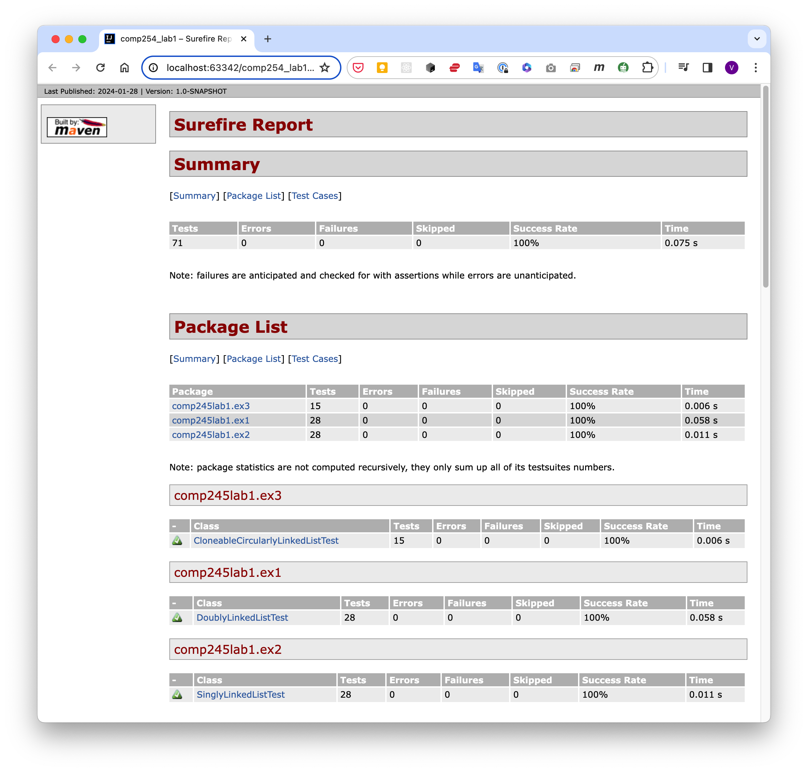
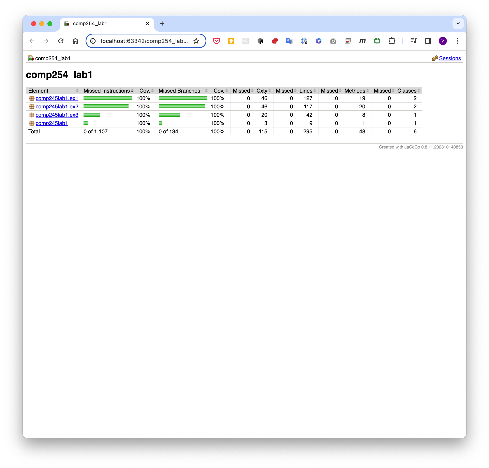
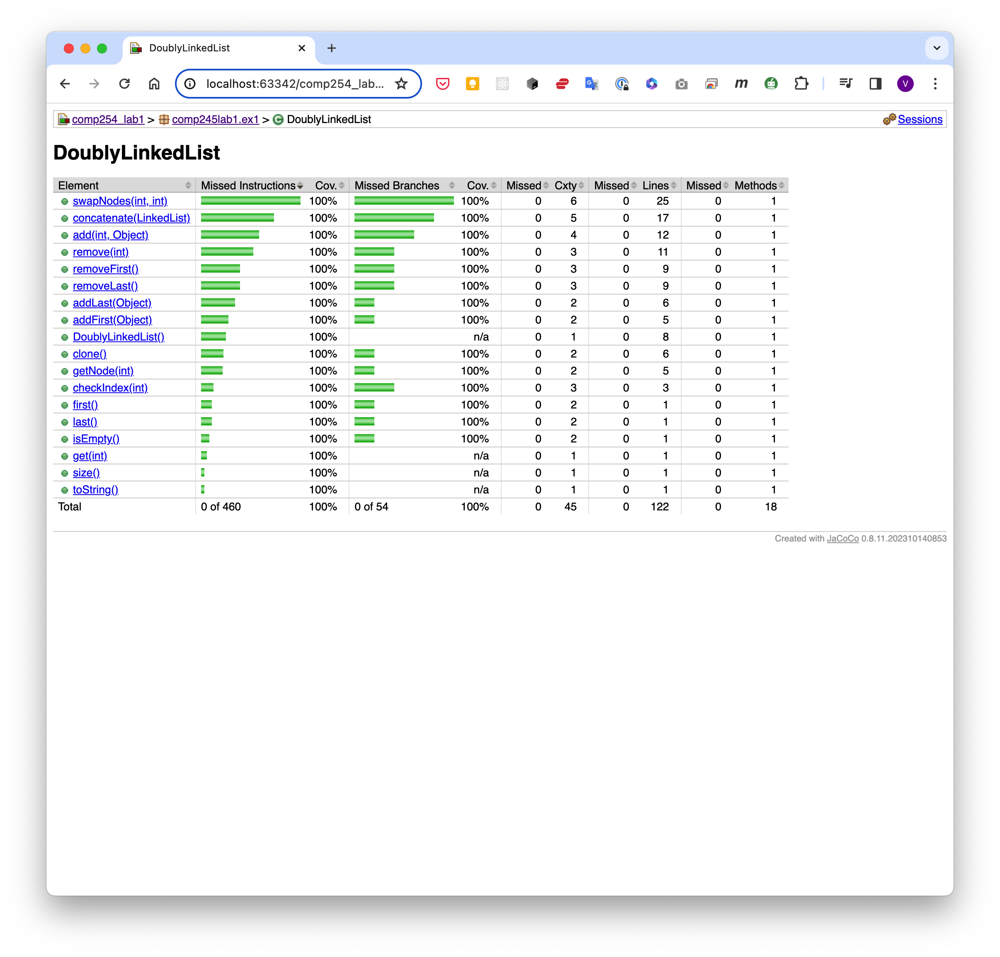
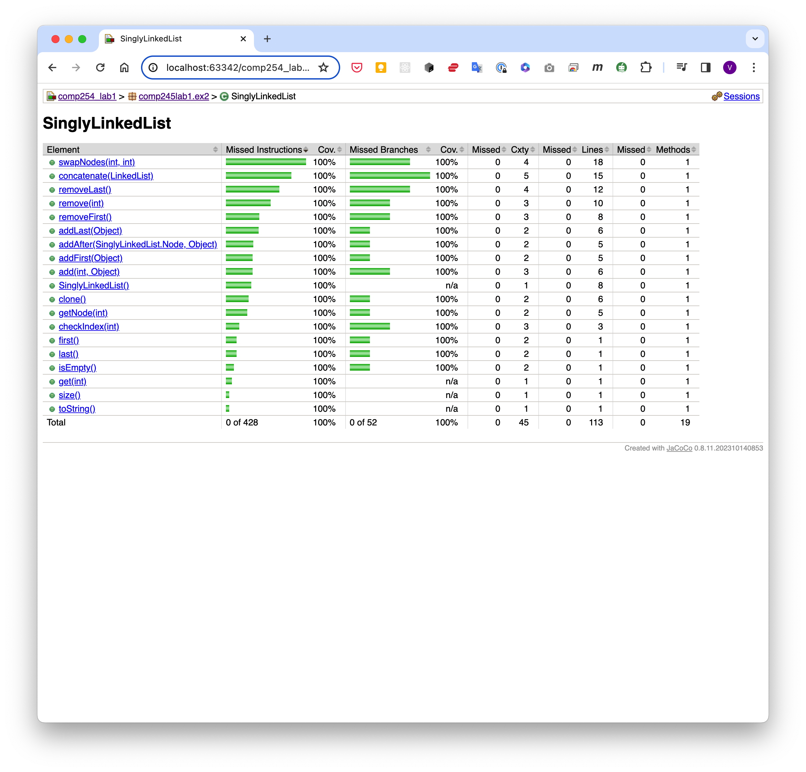
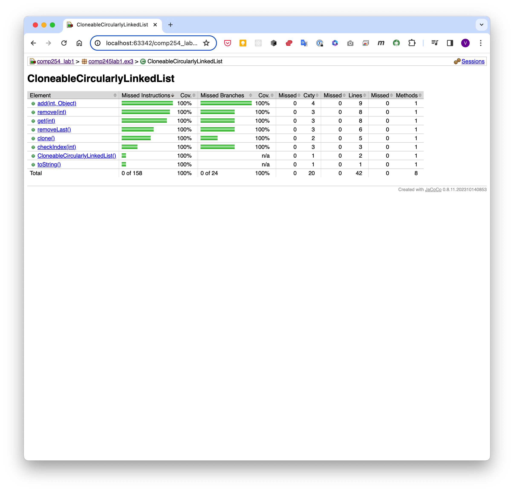

# COMP245 - Data Structures and Algorithms Lab 1

## Description
This is the first lab for COMP245 - Data Structures and Algorithms.
I implemented my own versions of SinglyLinkedList, DoublyLinkedList and
CloneableCircularlyLinkedList. The CloneableCircularlyLinkedList extends the
CircularlyLinkedList class
given in the exercise sample code of the course.

All the linked list classes implements the generic LinkedList interface.
The functionalities of concatenation, swapping and cloning are defined in
separate interfaces as ConcatenableLinkedList, SwappableLinkedList and
CloneableLinkedList respectively.

## Exercise 1
**Description:** Write a method for concatenating two doubly linked lists L and M, with header
and trailer sentinel nodes, into a single
list L′. Write a main method to test the new method. Hint: Connect the end of L
into the beginning of M.

The code can be found in the DoublyLinkedList class located in the
comp245lab1.ex1 package under the src/main/java
folder.

Unit tests of the concatenate function can be found in the
ConcatentableLinkedListTest class located in the comp245lab1
package under the src/test/java folder.

## Exercise 2
**Description:** Add a method swapNodes to SinglyLinkedList class from week 2 lecture examples.
This method should swap two nodes node1
and node2 (and not just their contents) given references only to node1 and
node2. The new method should check if node1
and node2 are the same node, etc

The code can be found in the SinglyLinkedList class located in the
comp245lab1.ex2 package under the src/main/java
folder.

Unit tests of the swapNodes function can be found in the SwappableLinkedListTest
class located in the comp245lab1
package under the src/test/java folder.

## Exercise 3

**Description:** Add a clone() method to CircularlyLinkedList class from week 3 lecture examples.

The code can be found in the CloneableCircularlyLinkedList class located in the
comp245lab1.ex3 package under the
src/main/java folder.

Unit tests of the clone function can be found in the CloneableLinkedListTest
class located in the comp245lab1 package
under the src/test/java folder.

## Unit Test Results
The unit tests report can be found in the target/site/surefire-reports.html file.

## Unit Test Code Coverage
The code coverage of the unit tests is 100% for all the classes. Please see
the reports in the target/site/jacoco folder.

### Summary:

### DoublyLinkedList:

### SinglyLinkedList:

### CloneableCircularlyLinkedList:

